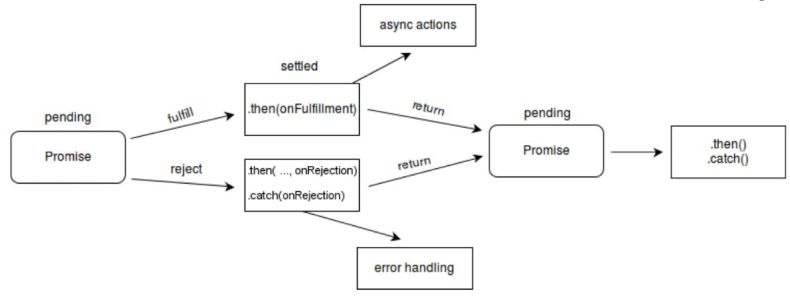

## JavaScript's Event Loop
* JavaScript's model of concurrency is co-operative multitasking
    * Tasks are queued up and executed in a loop
    * Achieves the benefits of asynchronous programming with the reasonability of synchronous programming
* Each JavaScript Engine generally follows this procedure:
    1. Execute JS script top-down
    2. Wait for events in a loop
    3. If an event comes and there is a handler for it, execute it to completion
    4. Repeat 2 ad infinitum
* The event loop runs on a single thread


## AJAX
* AJAX (Asynchronous Javascript And HTML) is a set of techniques to create asynchronous web apps
* An example is the use of the `XMLHttpRequest` object for asynchronous communication
* `XMLHttpRequest` is not primarily used nowadays to prevent <a href="http://callbackhell.com/">callback hell</a>, more recently the `Fetch` API is used to allow more cleaner code.

## Promises
* A Promise is an object that can produce a single value some time in the future: either a resolved value or a reason that it is not resolved.
* It is a good way to handle asynchronous operations.


```js
// Creates a brand new Promise
const myPromise = new Promise ( executor: (resolve, reject) => {
    // if the action succeeds, call resolve) with the result / or, if the action failed, call reject() with the reason
});

myPromise.then ( 
    () => {
        // this callback will be called if myPromise is fulfilled
    },
    () => {
        // this specific callback will be called if myPromise is rejected
    }
);

// In addition to giving a callback for errors in .then(), you can give a 
// catch-all error handler as .catch() 
myPromise.catch(
    () => {
        // handle the problem here
    }
);
```

## Fetch
* Fetch is a promise-based JS API to download remote resources
* A fetch will return a promise

```js
// only the URL is required
fetch("http://example.com/movies.json", {
    method: "POST",
    // this object is optional
})
// return the body as JSON 
.then (res => res.json())
// finally access the JSON 
.then (js => console.log(js));
```