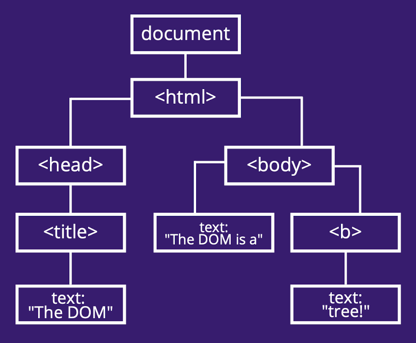

## Insert JS into HTML
* Inline method:
    * Better method as it improves performance

```html
<script type="text/javascript"> 
    const a = 1 + 2;
    console.log(a);
</script>>
```

* External:
    * Preferably placed at the bottom of `body` so that the page can load before any code
```html
<script type="text/javascript" src="mywork.js"></script>
```

## The DOM
* Allows JavaScript to access and update the content, structure and style of document
* The DOM has a tree-like structure:

```html
<!DOCTYPE HTML>
  <html>
    <head>
      <title>The DOM</title>
    </head>
    <body>
      The DOM is a <b>tree!</b>
    </body>
</html
```



### DOM Data Types:
* `document`: represents the root of the DOM object
* Element: a node in the DOM tree, e.g:
* NodeList: an array of elements

### Reading the DOM
* `let element = `
    * `document.getElementById(id)`
    * `document.getElementByTagName(name)`
    * `document.getElementByClassName(classname)`
    * `document.querySelector(query)`: returns first element that matches the selector
    * `document.querySelectorAll(query)`: returns a node list of all matches to the selector

### Writing to the DOM
* `let element = document.createElement('div')`
* `let element = document.createTextNode('some text')`
* `element.addChild(textNode)`
* `element.removeChild(textNode)`
* `button.setAttribute('disabled', '')`
* `element.classList`
    * `.add('classname')`
    * `.remove('classname')`
    * `.toggle('classname)`: turns the style on/off
    * `.contains('classname')`: returns true/false

### Changing/Getting Style of an Element
* `element.style.backgroundColor = 'red'`
* `element.style.left = '50px'`
* `element.style.left = parseInt(element.style.left, 10) + 5 + 'px'`

### Scrolling
```js
// Get the current scroll position of the page 
console.log(window.scrollx); 
console.log(window.scrollY);

// Scroll to a position on the page:
window.scrollTo({
top: 100, 
left: 0, 
behavior: "smooth",
});
```

## Events
* An event is a signal that a 'thing' has happened to a DOM element, such as a click or key press
* Examples:
    * Mouse events: 
        * `click`
        * `dblclick`: double click
        * `mousedown`: push mouse button down
        * `mouseup`: lift mouse button up
        * `mouseenter`: enters an area
        * `mouseleave`: leaves an area
    * Keyboard events:
        * `keydown`
        * `keypress`
        * `keyup`
    * More:
        * `error`
        * `load`
        * `fullscreenchange`
        * `submit`
        * `canplay`
        * `canplaythrough`
        * `animationstart`

### Event Handler
* Code run in response to an event
* Add event handler in:
    * HTML:

    ```html
    <input
    value="Click me"
    onclick="alert('Clicked!')"
    type="button"
    >
    ```
    * JS:
    ```js
    let element = document.getElementById('btn');

    doSomething = () => {
        alert('Button was clicked!');
    }

    element.onclick = doSomething // no parenthesis, assign attribute as the function, can only do one event handling
    ```

### Event Listener
* To add more than one function to an event, use an event listener:

```js
document.addEventListener('mousemove', (event) => {
    console.log(event.clientX);
    console.log(event.clientY);
});
```
* Notice, there is an `event` object
    * `event.currentTarget`: current element handler is running on
    * `event.timeStamp`: time the event was created (in ms)
    * `event.type`: name of event, e.g. 'click'
    * `event.key`: which key was pressed
    * `event.preventDefault()`: prevents default behaviour, e.g. toggle box won't toggle

### The Event Loop
* The event loop is a single-threaded loop that runs in the browser and manages all events
* When an event is triggered, the event is added to the queue
* JS uses a run-to-completion model, meaning it will not handle a new event until the current event has completed

## Forms
* `document.forms.test`: the form with name="test"
* `document.forms["test"]`: the form with name="test"
* `document.forms[0]`: the first form in the document
* `const age = form.elements.age`: retunrs list of age elements of a form
* Backreferencing is possible
* `input.value`
* `input.checked`
* `select.options`: collection of option(s)
* `select.value`: value of options selected
* `select.selectedIndex`: index of currently selected option

## Live Storage
* Sometimes we want data to be persistent
* This can be done via a database or local storage
* `window.localStorage` is an API that allows you to read and write to a storage object in that document

```js
// Add a data item given the key and value
localStorage. setItem(key, value);

// Retrieves an item from localstorage given a key
const value = localStorage.getItem (key) ;

// Remove an item with a given key from localstorage
localStorage.removeItem(key);

// Remove all items from localstorage
localStorage.clear ();
```
